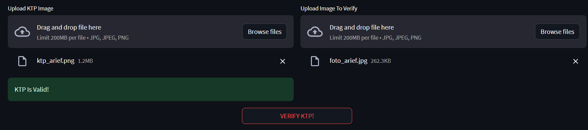
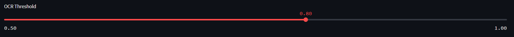
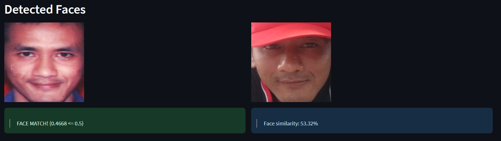
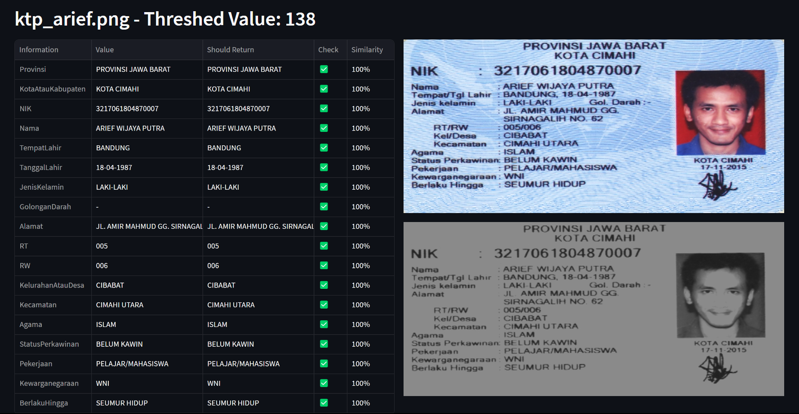
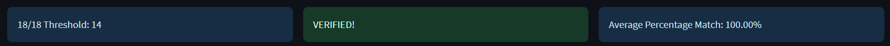
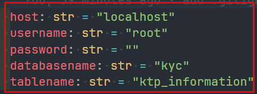
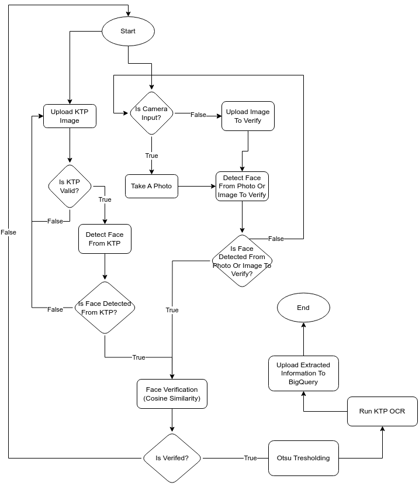

# Indonesian-KTP-KYC
Welcome to the Indonesian KTP KYC project! This tool simplifies the process of identity verification using Indonesian KTP (Kartu Tanda Penduduk).
<a name="readme-top"></a>

<!--
*** I'm using markdown "reference style" links for readability.
*** Reference links are enclosed in brackets [ ] instead of parentheses ( ).
*** for contributors-url, forks-url, etc. This is an optional, concise syntax you may use.
*** https://www.markdownguide.org/basic-syntax/#reference-style-links
-->
[![Contributors][contributors-shield]][contributors-url]
[![Forks][forks-shield]][forks-url]
[![Stargazers][stars-shield]][stars-url]
[![Issues][issues-shield]][issues-url]
[![MIT License][license-shield]][license-url]
[![LinkedIn][linkedin-shield]][linkedin-url]


<!-- PROJECT LOGO -->
<br />
<div align="center">
  <a href="https://github.com/StefannusChristian/Indonesian-KTP-KYC">
    <h1>Internship Project</h1>
  <p align="center">
    <a href="https://github.com/StefannusChristian/Indonesian-KTP-KYC">View Demo</a>
    ·
    <a href="https://github.com/StefannusChristian/Indonesian-KTP-KYC/issues">Report Bug</a>
    ·
    <a href="https://github.com/StefannusChristian/Indonesian-KTP-KYC/issues">Request Feature</a>
  </p>
</div>

<!-- TABLE OF CONTENTS -->
<details>
  <summary>Table of Contents</summary>
  <ol>
    <li><a href="#project-overview">Project Overview</a></li>
    <li><a href="#built-with">Built With</a></li>
    <li><a href="#prerequisites">Prerequisites</a></li>
    <li><a href="#getting-started">Getting Started</a></li>
    <li><a href="#disclaimer">Disclaimer</a></li>
    <li><a href="#roadmap">Roadmap</a></li>
    <li>
      <a href="#project-flow">Project Flow</a>
      <ul>
        <li><a href="#flowchart">Flowchart</a></li>
      </ul>
    </li>
    <li><a href="#contributing">Contributing</a></li>
    <li><a href="#license">License</a></li>
    <li><a href="#contact">Contact</a></li>
  </ol>
</details>

<!-- ABOUT THE PROJECT -->
## Project Overview






<p align="right">(<a href="#readme-top">back to top</a>)</p>

## Built With

<!-- First Row -->
<div style="display: flex; flex-wrap: wrap; gap: 10px;">
  <a href="https://www.python.org/">
    
  </a>
  <a href="https://github.com/tesseract-ocr/tesseract">
    
  </a>
  <a href="https://www.streamlit.io/">
    
  </a>
  <a href="https://pillow.readthedocs.io/">
    
  </a>
</div>

<!-- Second Row -->
<div style="display: flex; flex-wrap: wrap; gap: 10px;">
  <a href="https://www.tensorflow.org/">
    
  </a>
  <a href="https://keras.io/">
    
  <a href="https://opencv.org/">
    
  </a>
  </a>
  <a href="https://docs.python.org/3/library/re.html">
    
  </a>
</div>

<!-- Third Row -->
<div style="display: flex; flex-wrap: wrap; gap: 10px;">
  <a href="https://github.com/ipazc/mtcnn">
    
  </a>
  <a href="https://pandas.pydata.org/">
    
  </a>
  <a href="https://numpy.org/">
    
  </a>
  <a href="https://www.scipy.org/">
    
  </a>
</div>

<!-- Fourth Row -->
<div style="display: flex; flex-wrap: wrap; gap: 10px;">
  <a href="https://keras.io/api/applications/resnet/">
    
  </a>
  <a href="https://cloud.google.com/bigquery">
    
  </a>
  <a href="https://en.wikipedia.org/wiki/Otsu%27s_method">
    
  </a>
</div>


<p align="right">(<a href="#readme-top">back to top</a>)</p>

## Prerequisites

Before you begin, ensure you have the following prerequisites:

1. **Python**
   If Python is not installed on your system, you can follow this installation guide: [Python Installation Guide](https://www.youtube.com/watch?v=YYXdXT2l-Gg)

2. **Pytesseract**
   Ensure you have Pytesseract installed by referring to this installation guide: [Pytesseract Installation Guide](https://pythonforundergradengineers.com/how-to-install-pytesseract.html)

3. **Anaconda**
   If you don't have Anaconda installed, you can install it using this guide: [Anaconda Installation Guide](https://docs.anaconda.com/free/anaconda/install/)

4. **XAMPP / WampServer**
   To set up your database, you'll need XAMPP or WampServer. Install XAMPP from this link: [XAMPP](https://www.apachefriends.org/download.html) or WampServer from this link: [WampServer](https://www.wampserver.com/en/)

<p align="right">(<a href="#readme-top">Back to top</a>)</p>


## Getting Started

1. **Clone the repo**
  ```sh
  git clone https://github.com/StefannusChristian/Indonesian-KTP-KYC.git
  ```
2. **Create Virtual Environment With Python 3.8.16**
  ```sh
  conda create -n yourenvname python=3.8.16
  conda activate yourenvname
  ```
> **Note**: The choice of Python 3.8.16 as the recommended version for this project is based on its compatibility with essential libraries like TensorFlow, NumPy, and Keras. This version provides a stable and well-tested environment to ensure seamless integration and reliable functionality.

3. **Install Requirements**
  ```sh
  pip install -r requirements.txt
  ```

4. **Configure pytesseract Path**
  <br><br>
   3.1 Go to the `python_files/ocr.py` directory
  <br><br>
   3.2 Update the `self.pytesseract_path` to your pytesseract installation path
   

5. **Turn On MySQL From XAMPP or WampServer**

   Before starting the project, ensure that MySQL is active on your local server. If you're using XAMPP or WampServer, follow these steps to enable MySQL:

   

6. **Configure Local Database**

   Before starting the project, change the username and password to your mysql password, the default username should be `root` and the default password should be an `empty space` this file is located in `python_files/kyc.py`

    

7. **Run The Project**

   Follow these steps to run the project:

   - Navigate to the `python_files/` directory in your terminal:
     ```sh
     cd python_files
     ```

   - Make sure your virtual environment is activated, then execute the following command:
     ```sh
     streamlit run kyc.py
     ```

   The project will automatically open in your default browser at http://localhost:8501.


<br><br>

<p align="right">(<a href="#readme-top">back to top</a>)</p>

## Disclaimer

The FACE VERIFICATION DEMO PAGE's image comparison functionality may not work as expected due to the removal of confidential KTP data. To ensure proper functionality, follow these steps:

1. Navigate to the `images/image_for_face_verification` directory.
2. Place the image files for comparison in the `images/image_for_face_verification/image_1_to_compare` directory.
3. Place the corresponding second set of image files in the `images/image_for_face_verification/image_2_to_compare` directory.

Thank you for your understanding.

<p align="right">(<a href="#readme-top">Back to top</a>)</p>


## Project Flow

1. **Input KTP Information**  
   Start by providing accurate details from your Indonesian KTP. 

2. **KTP Validation**  
   The program automatically validates the provided KTP information for accuracy and consistency, checking for common errors and discrepancies.

3. **Face Verification**  
   Upon successful KTP validation, upload a self-image. The program performs face verification to confirm your identity.

4. **Optical Character Recognition (OCR)**  
   After identity verification, the program employs OCR technology to extract text from your KTP image, presenting it in a structured format.

5. **Results and Confirmation**  
   Receive a summary of extracted KTP information along with identity verification confirmation.

### Flowchart
Here is the flowchart for you to better understand about the flow of this project.




<p align="right">(<a href="#readme-top">back to top</a>)</p>


<!-- ROADMAP -->
## Roadmap

- [ ] Add Brute Force Thresholding Algorithm
- [ ] Add Is a Big Query Option

See the [open issues](https://github.com/StefannusChristian/Indonesian-KTP-KYC/issues) for a full list of proposed features (and known issues).

<p align="right">(<a href="#readme-top">back to top</a>)</p>

<!-- CONTRIBUTING -->
## Contributing

If you have a suggestion that would make this better, please fork the repo and create a pull request. You can also simply open an issue with the tag "enhancement".
Don't forget to give the project a star! Thanks again!

1. Fork the Project
2. Create your Feature Branch (`git checkout -b feature/AmazingFeature`)
3. Commit your Changes (`git commit -m 'Add some AmazingFeature'`)
4. Push to the Branch (`git push origin feature/AmazingFeature`)
5. Open a Pull Request

<p align="right">(<a href="#readme-top">back to top</a>)</p>

<!-- LICENSE -->
## License

Distributed under the MIT License. See `LICENSE.txt` for more information.

<p align="right">(<a href="#readme-top">back to top</a>)</p>

<!-- CONTACT -->
## Contact

StefannusChristian - [LinkedIn](linkedin-url) - stefannuschristian@gmail.com

Project Link: [https://github.com/StefannusChristian/Indonesian-KTP-KYC](https://github.com/StefannusChristian/Indonesian-KTP-KYC)

<p align="right">(<a href="#readme-top">back to top</a>)</p>

<!-- MARKDOWN LINKS & IMAGES -->
<!-- https://www.markdownguide.org/basic-syntax/#reference-style-links -->
[contributors-shield]: https://img.shields.io/github/contributors/StefannusChristian/Indonesian-KTP-KYC.svg?style=for-the-badge

[contributors-url]: https://github.com/StefannusChristian/Indonesian-KTP-KYC/graphs/contributors

[forks-shield]: https://img.shields.io/github/forks/StefannusChristian/Indonesian-KTP-KYC.svg?style=for-the-badge

[forks-url]: https://github.com/StefannusChristian/Indonesian-KTP-KYC/network/members

[stars-shield]: https://img.shields.io/github/stars/StefannusChristian/Indonesian-KTP-KYC.svg?style=for-the-badge

[stars-url]: https://github.com/StefannusChristian/Indonesian-KTP-KYC/stargazers

[issues-shield]: https://img.shields.io/github/issues/StefannusChristian/Indonesian-KTP-KYC.svg?style=for-the-badge

[issues-url]: https://github.com/StefannusChristian/Indonesian-KTP-KYC/issues

[license-shield]: https://img.shields.io/github/license/StefannusChristian/Indonesian-KTP-KYC.svg?style=for-the-badge

[license-url]: https://github.com/StefannusChristian/Indonesian-KTP-KYC/blob/master/LICENSE.txt

[linkedin-shield]: https://img.shields.io/badge/-LinkedIn-black.svg?style=for-the-badge&logo=linkedin&colorB=555

[linkedin-url]: https://www.linkedin.com/in/stefannus-christian-295589209/

[product-screenshot]: images/screenshot.png

[Python]: https://img.shields.io/badge/Python-3776AB?style=for-the-badge&logo=python&logoColor=white

[Python-url]: https://www.python.org/

[Pandas]: https://img.shields.io/badge/Pandas-150458?style=for-the-badge&logo=pandas&logoColor=white

[Pandas-url]: https://pandas.pydata.org/

[TensorFlow]: https://img.shields.io/badge/TensorFlow-FF6F00?style=for-the-badge&logo=tensorflow&logoColor=white

[TensorFlow-url]: https://www.tensorflow.org/

[PyTesseract]: https://img.shields.io/badge/PyTesseract-000000?style=for-the-badge&logo=python&logoColor=white

[PyTesseract-url]: https://github.com/madmaze/pytesseract

[NumPy]: https://img.shields.io/badge/NumPy-013243?style=for-the-badge&logo=numpy&logoColor=white

[NumPy-url]: https://numpy.org/

[Keras]: https://img.shields.io/badge/Keras-D00000?style=for-the-badge&logo=keras&logoColor=white

[Keras-url]: https://keras.io/

[SciPy]: https://img.shields.io/badge/SciPy-8CAAE6?style=for-the-badge&logo=scipy&logoColor=white

[SciPy-url]: https://www.scipy.org/